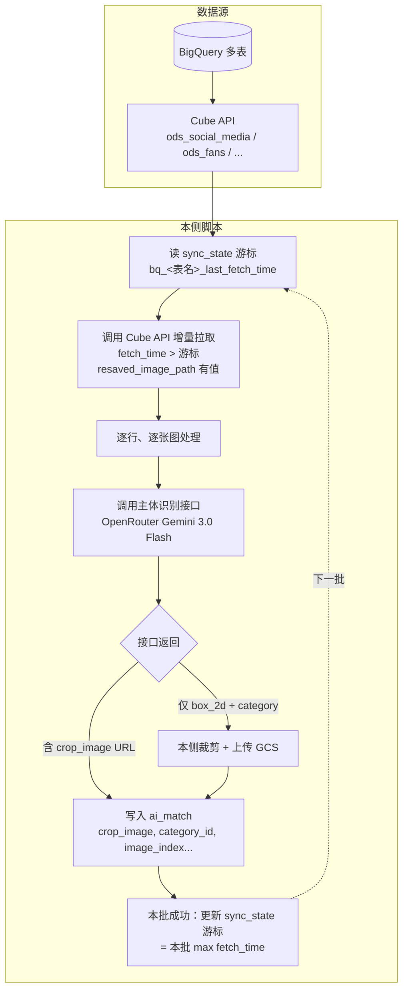
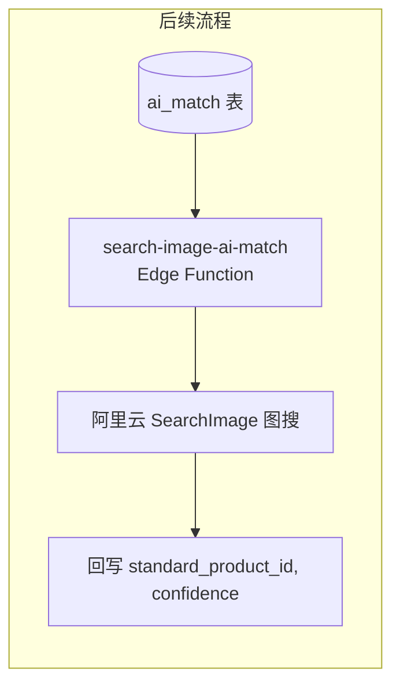
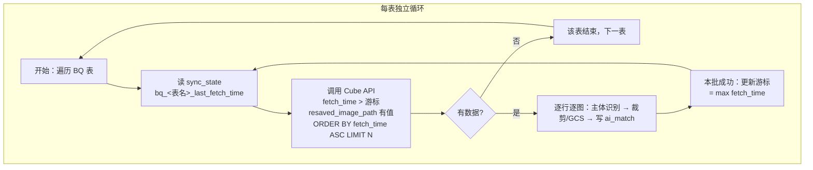
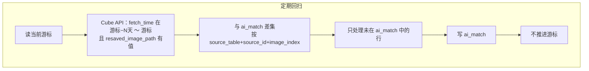

## 需要对爬虫的数据进行处理

爬虫数据存在于 BigQuery 中，数据在多张表中。**通过 Cube API 请求 BQ 数据**（Cube 作为 BQ 的语义层），将每张表的 resaved_image_path 中的图片 URL 进行主体识别，并汇总结果到 Supabase ai_match 表。

### ods_social_media（社媒数据）

```shell
id	STRING	唯一标识	
task_id	STRING	关联采集任务ID	
platform	STRING	固定值 ins	
account_type	STRING	celebrity / fan_account / blogger	
source_url	STRING	帖子唯一标识URL	
author_account	STRING	作者账号名	
publish_time	TIMESTAMP	发布时间（Unix秒）	
text_content	STRING	帖子文字内容	
image_file_path	ARRAY<STRING>	图片路径	
video_file_path	ARRAY<STRING>	视频路径	
like_count	INTEGER	点赞数	
comment_count	INTEGER	评论数	
fetch_time	TIMESTAMP	爬取时间	
is_matched	BOOLEAN	是否已AI匹配，默认FALSE	由is_analysis改字段名
matched_at	TIMESTAMP	AI匹配完成时间	由analyse_at改字段名
resaved_image_path	ARRAY<STRING>	转存图片链接	
resaved_video_path	ARRAY<STRING>	转存视频链接	
image_tag	STRING	图片标签	
data_owner	STRING	数据归属人	
source_name	STRING	补充字段，配置权重，填写人名	新增字段
```


### 通过 Cube 拉取的 BQ 数据最终汇总到 Supabase ai_match 表

```shell
字段名	类型	说明	必要性
id	STRING	自动生成UUID	
source_table	STRING	来源表名：ods_social_media/ods_fans/ods_fashion_media/ods_ecommerce/ods_brand	因为5张表是独立的表，各自的 id 只在本表内唯一，不同表之间 id 可能重复。
source_id	STRING	来源表的id（外键）	关联来源表的唯一键，统计时需要 JOIN 获取 source_name/fetch_time
source_name			
standard_product_id	STRING	匹配到的 standard_products.id（外键）	核心匹配结果，关联标准商品库
confidence	FLOAT64	匹配置信度，0-1	阿里云图搜返回的置信度，用于筛选可信匹配
crop_image_url	STRING	裁剪后的商品主体图转存url	
crop_image	STRING	本次匹配中，所使用的AI识别主体图的转存url	测试和前端要求展示时需要用到
create_time	TIMESTAMPTZ	自动生成	审核
category_id			存储经过主体识别prompt的品类编号
image_index		记录是图片数组的第几张图片	
```

## 主体识别

### 澄清与约定

- **crop_image**：主体识别得到裁剪图后，**转存到 GCS 后的 URL**，写入 ai_match 的 crop_image（或 crop_image_url）字段。
- **主体识别实现**：调用**已实现的接口**，该接口内部通过 **OpenRouter 使用 Gemini 3.0 Flash** 完成检测与裁剪；本需求只负责 Cube 拉取 BQ 数据 → 调该接口 → 写 ai_match，不实现模型本身。
- **category_id**：从主体识别接口返回的 **category** 获取（即 Prompt 中的 3/4/5/88888888），写入 ai_match.category_id。
- **增量更新**：仅处理**新增或未处理**的数据，需有游标或标记（例如按 fetch_time，或在本侧 sync_state 表记录每张表已处理到的 fetch_time），避免全量重跑。数据通过 **Cube API** 拉取，Cube 底层查询 BQ。

### API

调用已封装接口（内部使用 OpenRouter Gemini 3.0 Flash）；接口入参/出参、裁剪图上传 GCS 的流程以实际实现为准。

## 主体识别Prompt

```shell
你是一个计算机视觉目标检测模型。
请从输入图片中检测并提取“主体目标”，仅限以下 4 类之一：
- 3：bag（包类，如手提包、背包、钱包、行李袋等）
- 4：Shoes（鞋类，如运动鞋、皮鞋、靴子、凉鞋等）
- 5：Accessories（配饰类，如帽子、围巾、腰带、首饰、眼镜等）
- 88888888：clothing（服装类，如上衣、裤子、裙子、外套等）
【检测规则】
1. 只检测清晰、完整、可识别的主体目标  
2. 同一类别可返回多个目标  
3. 忽略背景物体、非穿戴类物品、装饰性道具  
4. 若目标被严重遮挡、模糊或不可辨认，请不要返回  
5. 优先选择画面中视觉占比大、清晰度高的目标  
【坐标规则】
- 使用二维边界框 box_2d
- 格式为：[ymin, xmin, ymax, xmax]
- 坐标范围为 0–1000 的归一化整数
- ymin < ymax，xmin < xmax
【置信度规则】
- score 取值范围 0.0–1.0
- 表示你对该目标类别判断的置信度
【输出格式要求】
- 仅返回 JSON
- 不要输出任何解释说明
- 返回一个数组，每个元素结构如下：
  
{
  "box_2d": [ymin, xmin, ymax, xmax],
  "category": "编号",
}
如果未检测到任何符合条件的主体，请返回空数组 []。
```

---

## 方案（供评估）

### 1. 整体数据流





**说明**：
- **crop_image**：GCS 转存后的 URL。  
- **category_id**：主体识别返回的 category（3/4/5/88888888）。  
- **增量**：方案乙，通过 **Cube API** 拉取 BQ 数据，游标存 sync_state（fetch_time > 游标），见 3.1。

### 2. 实现形态建议

| 方式 | 说明 | 适用 |
|------|------|------|
| **A. Python 脚本（推荐）** | 本地或服务器定时跑：**调用 Cube API** 拉取 BQ 数据、调主体识别、裁剪/上传 GCS、写 Supabase。 | Cube 与 sync_cube_to_supabase 一致；GCS 需服务端凭证；易复用 fetch_cube_data 的 CubeClient。 |
| **B. Edge Function + pg_cron** | 定时触发 Edge Function，在 Deno 里调 BQ API、主体识别、GCS。 | 需 BQ/GCS 在 Edge 侧可访问（REST 或代理）；凭证与权限较麻烦。 |
| **C. 混合** | 主体识别 + 裁剪 + GCS 由已有服务/接口完成；本侧仅「拉 BQ 未处理行 → 调该接口 → 写 ai_match」。 | 若主体识别接口已包含「裁剪并上传 GCS、返回 URL」，本侧只做编排。 |

**推荐 A**：通过 **Cube API** 拉取，与现有 sync_cube_to_supabase、fetch_cube_data 一致；GCS 需服务端凭证；增量游标放 Supabase sync_state。

### 3. 增量策略

- **方案甲**：BQ 侧 `is_matched = FALSE` 拉取，处理完后**写回 BQ** 的 `is_matched = TRUE`、`matched_at = now()`。需 BQ 写权限与对应表结构。  
- **方案乙**：本侧在 **Supabase sync_state** 存每张表的游标（如 `bq_ods_social_media_last_fetch_time`），每次通过 **Cube API** 只拉 `fetch_time > 游标` 的行；处理完一批后更新游标。BQ 不可写，只读。**（详见 3.1）**  
- **方案丙**：BQ 表有「已处理」标记且可写时用方案甲；否则用方案乙。

#### 3.1 方案乙（BQ 不可写）详细设计

**采用条件**：BQ 无写权限，无法更新 `is_matched` / `matched_at`，增量完全由本侧游标控制。数据通过 **Cube API** 拉取（Cube 底层查 BQ）。

**方案乙 批处理流程图**



**可选：回扫流程（策略 B，兜住滞后补充的 resaved_image_path）**



**1. 游标存储**

- **表**：复用现有 Supabase **sync_state** 表（`key` TEXT PRIMARY KEY, `value` TEXT, `updated_at` TIMESTAMPTZ）。
- **key 命名**：每张 BQ 表一个游标 key，与表名一一对应，例如：
  - `bq_ods_social_media_last_fetch_time`
  - `bq_ods_fans_last_fetch_time`
  - `bq_ods_fashion_media_last_fetch_time`
  - `bq_ods_ecommerce_last_fetch_time`
  - `bq_ods_brand_last_fetch_time`
- **value 含义**：该 BQ 表「已处理到的」最大 **fetch_time**，存为 **ISO 8601 字符串**（如 `2025-01-29T10:00:00Z`），与 BQ 的 TIMESTAMP 比较时需统一时区（建议 UTC）。

**2. Cube API 增量拉取（每表）**

- **方式**：调用 **Cube REST API**（`POST /v1/load`）或 GraphQL，与现有 `fetch_cube_data.py` 的 `CubeClient.load()` 一致。Cube 需有对应 model/view 暴露 ods_social_media、ods_fans 等表（若暂无需在 Cube 侧创建）。
- **条件**：`fetch_time > 游标`（若该表无游标则视为首次，可全量或仅拉「最近 N 天」）。
- **排序**：`order: { "<cube>.<fetch_time>": "asc" }`，保证按时间顺序处理，游标单调推进。
- **分页**：每批 `limit`（如 100～500 行）、`offset`，下一批继续用同一游标直到本批处理完再更新。
- **选取维度**：至少 `id`, `resaved_image_path`, `source_name`, `fetch_time`；若表无 `source_name` 则用配置或空串。
- **过滤（必须）**：`filters` 中需包含 `resaved_image_path` 有值（如 `operator: "set"` 或 Cube 支持的「非空」条件），只处理有图行。

示例（ods_social_media_view，游标 `last_fetch_time`，Cube REST 格式）：

```json
{
  "dimensions": ["ods_social_media_view.id", "ods_social_media_view.resaved_image_path", "ods_social_media_view.source_name", "ods_social_media_view.fetch_time"],
  "filters": [
    {"member": "ods_social_media_view.resaved_image_path", "operator": "set"},
    {"member": "ods_social_media_view.fetch_time", "operator": "gt", "values": ["<last_fetch_time>"]}
  ],
  "order": {"ods_social_media_view.fetch_time": "asc"},
  "limit": 500,
  "timezone": "UTC"
}
```

**2.1 风险：resaved_image_path 滞后补充**

- **问题**：若数据中行的 `resaved_image_path` 是**事后才被补充**的（例如先有 fetch_time，转存图片后再更新该字段），仅用 `fetch_time > 游标` 会漏掉这些行：游标已按 fetch_time 推进到更晚时间，而该行 fetch_time 较早、当时拉取时 resaved_image_path 仍空被过滤掉，等 resaved_image_path 有值后也不会再被拉取（因其 fetch_time 已小于当前游标）。
- **结论**：在「BQ 不可写 + 仅用 fetch_time 作游标」的前提下，**滞后补充的 resaved_image_path 确实可能拉不到**，需通过下面缓解策略弥补。

**2.2 缓解策略（可选）**

- **策略 A（推荐，若 BQ 有相关字段）**：若 BQ 表存在「resaved_image_path 更新时间」或「行最后更新时间」等字段（如 `updated_at`、`resaved_at`），可改为用该时间作游标，或在该时间上建索引，只拉「该时间 > 游标」且 resaved_image_path 有值的行，这样滞后补充的行会在其更新后被拉到。
- **策略 B（回扫/补扫）**：在正常 `fetch_time > 游标` 增量之外，**定期**（如每日）对每张表做一次「回扫」：拉取 `fetch_time` 在 **[游标 − N 天, 游标]** 且 **resaved_image_path 有值** 的行，与 Supabase ai_match 按 (source_table, source_id, image_index) 做差集，只处理尚未出现在 ai_match 中的行并写入；不推进游标。这样滞后补充的图会在回扫中被兜住，N 可根据数据延迟与成本取 3～7 天。
- **策略 C（以「未入 ai_match」为准）**：不单靠 fetch_time 游标，而是每批拉取「某时间窗口内 resaved_image_path 有值」的行（如 fetch_time 在最近 30 天），在脚本内与 ai_match 已存在的 (source_table, source_id, image_index) 做差集，只处理未出现的；游标仅用于限制「窗口」、避免全表扫描。需在脚本中查 Supabase 已处理集合，实现稍复杂，适合数据量可控场景。

实现时可根据 BQ 是否有「更新时间」类字段、以及对滞后补充的容忍度，选择 A/B/C 或组合（如日常用 fetch_time 增量 + 定期 B 回扫）。

**3. 批处理与游标更新时机**

- 每张表**独立**：按表逐表拉取、处理、更新该表游标，表与表之间游标互不影响。
- **单批流程**：读游标 → **Cube API** 拉本批 → 对每行每张图做主体识别 → 写 ai_match → 本批全部成功后，将游标更新为 **本批 max(fetch_time)**。
- **失败策略**：若本批中部分行/图失败（如主体识别超时、写 ai_match 失败），建议：
  - **保守**：本批不推进游标，下次重跑同一批（需脚本幂等，见下）；
  - **激进**：仅将「已成功处理到的」最大 fetch_time 写入游标，未处理行下次会再次被拉取（可能重复写 ai_match，依赖唯一约束去重）。

**4. 首次运行（无游标）**

- 若某表在 sync_state 中无对应 key：
  - **选项 A**：该表从「最早数据」拉取（Cube filters 仅 `resaved_image_path` 有值，`order` 按 fetch_time 升序，`limit` N），适合数据量可控或只跑一次全量；
  - **选项 B**：该表仅拉「最近一段时间」（Cube filters 加 `fetch_time > 7 天前` 且 `resaved_image_path` 有值），避免首轮全表扫描，适合大表。
- 无论选项 A/B，**Cube 查询 filters 均需包含 resaved_image_path 有值**。
- 实现时可由配置或环境变量指定「是否全量 / 仅最近 N 天」。

**5. ai_match 去重与幂等**

- **唯一约束**：在 ai_match 上建议建立 **(source_table, source_id, image_index)** 唯一约束，保证同一 BQ 行同一张图只对应一条 ai_match。
- **写入方式**：插入时使用 `INSERT ... ON CONFLICT (source_table, source_id, image_index) DO UPDATE SET crop_image = EXCLUDED.crop_image, category_id = EXCLUDED.category_id, ...`，或先查再决定 INSERT/UPDATE，这样同一批重跑或游标未推进时不会产生重复记录。

**6. 多表处理顺序**

- 各表游标独立，表之间可**串行**（先 ods_social_media 一批，再 ods_fans 一批…）或**并行**（多进程/多线程各处理一表），按运维与 QPS 限制选择即可。

**7. 小结（方案乙）**

| 项 | 说明 |
|----|------|
| 游标位置 | Supabase sync_state，key = `bq_<表名>_last_fetch_time` |
| 游标含义 | value = 该表已处理到的 max(fetch_time)，ISO 字符串 |
| Cube 拉取 | `fetch_time > 游标`，**resaved_image_path 有值**，order asc，limit N |
| 更新时机 | 本批处理成功后，游标 = 本批 max(fetch_time) |
| 首次无游标 | 全量或「最近 N 天」二选一，由配置决定 |
| 幂等 | ai_match 唯一约束 (source_table, source_id, image_index) + upsert |
| 数据源 | 通过 Cube API 拉取 BQ，BQ 只读不写 |
| 风险与缓解 | resaved_image_path 滞后补充会导致漏拉；见 2.1 / 2.2（用更新时间游标 / 定期回扫 / 以未入 ai_match 为准） |

### 4. 组件与依赖

- **Cube API**：调用 Cube 拉取多表（ods_social_media 等），筛选 `fetch_time > 游标` 且 **resaved_image_path 有值**，取 id、resaved_image_path、source_name、fetch_time 等。Cube 底层查 BQ，需 Cube 侧有对应 model/view。  
- **主体识别接口**：已实现（OpenRouter Gemini 3.0 Flash）；需约定入参（原图 URL 或 base64）、出参（box_2d + category，或直接 crop_image URL）。  
- **GCS**：若接口不负责上传，本侧需按 box_2d 裁剪并上传，得到 crop_image URL；需 GCS bucket、路径规则、凭证。  
- **Supabase**：写 ai_match（source_table, source_id, source_name, crop_image, category_id, image_index, standard_product_id=null, confidence=0）；**方案乙**下 sync_state 存每张 BQ 表的游标（key=`bq_<表名>_last_fetch_time`）。

### 5. 前置条件与待定项

- 主体识别接口的 **URL、请求/响应格式**（是否含裁剪图 GCS URL）。  
- 若本侧负责裁剪 + 上传 GCS：**bucket 名、路径规则、凭证方式**。  
- **BQ 不可写**：已确定采用方案乙，通过 **Cube API** 拉取，游标存 Supabase sync_state（见 3.1）。  
- **Cube 侧**：需在 Cube 中创建/配置 model 或 view 暴露 ods_social_media、ods_fans 等表，并支持 id、resaved_image_path、source_name、fetch_time 维度及 fetch_time 过滤。各表结构若有差异需做字段映射。

### 6. 工作量粗估（按推荐方案 A）

- Cube API 增量拉取 + 游标（sync_state）：约 0.5～1 天（依赖 Cube 侧 model 是否已就绪）。  
- 调主体识别接口 + 解析 box_2d/category：约 0.5 天（依赖接口文档）。  
- 裁剪 + 上传 GCS（若本侧做）：约 1 天（依赖 bucket/凭证）。  
- 写 ai_match + 去重/幂等（如 source_table+source_id+image_index）：约 0.5 天。  
- 定时/重试/日志：约 0.5 天。  

**合计**：约 3～4 人天（不含主体识别接口本身的开发与联调时间）。

---

## 实现要点（待接口定稿后落实现）

**增量采用方案乙**（BQ 不可写，游标存 Supabase sync_state，见 3.1）。

1. **Cube API 增量拉取**：按每张表分别拉取；每表从 sync_state 读 key=`bq_<表名>_last_fetch_time` 的 value 作为游标，调用 **Cube REST API**（`CubeClient.load`）只拉 `fetch_time > 游标` 且 **resaved_image_path 有值** 的行，`order` 按 fetch_time 升序，`limit` N；无游标时按配置做「全量」或「最近 N 天」，同样必须满足 resaved_image_path 有值。
2. **按行按图处理**：对每行的 `resaved_image_path` 数组逐张图调用**主体识别接口**（入参：图片 URL 或可访问方式）；接口返回检测结果（含 box_2d、category）。
3. **裁剪与转存 GCS**：根据返回的 box_2d 对原图裁剪，将裁剪图上传 GCS，得到 **crop_image** URL（若接口已包含「裁剪并上传 GCS」则直接使用返回的 URL）。
4. **写入 ai_match**：每条检测结果写一条 ai_match：source_table、source_id、source_name、**crop_image**（GCS URL）、**category_id**（接口返回的 category）、image_index（第几张图）、standard_product_id 空、confidence 0；使用 (source_table, source_id, image_index) 唯一约束 + upsert 保证幂等；后续由 search-image-ai-match 做图搜回写。
5. **更新游标**：本批全部处理成功后，将本批 **max(fetch_time)** 写入 sync_state 对应 key（`bq_<表名>_last_fetch_time`）；失败策略见 3.1。