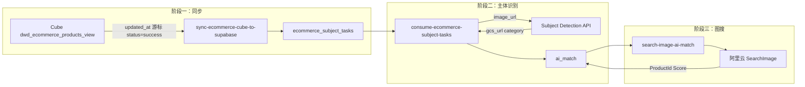

# 电商数据同步与主体识别完整设计

## 一、数据流概览

**设计简化**：仅用一张中间表 `ecommerce_subject_tasks`，商品信息（product_id、product_name 等）冗余到任务行，无需单独的 ecommerce_products 表。

---

## 二、Supabase 表结构设计

### 2.1 主体识别任务表 `ecommerce_subject_tasks`（唯一中间表）

按「每张图」一条记录，冗余商品信息，同步与主体识别共用此表。

| 字段 | 类型 | 说明 |
|------|------|------|
| id | uuid PK | 默认 gen_random_uuid() |
| product_id | text NOT NULL | 商品 ID（对应 ai_match.source_id） |
| product_name | text | 商品名（对应 ai_match.source_name） |
| image_url | text NOT NULL | stored_url，待主体识别的图片 |
| position | integer NOT NULL | 图片序号（对应 ai_match.image_index） |
| status | text | pending / done / failed |
| crop_image | text | 主体识别返回的 GCS URL（成功后写入） |
| category_id | text | 主体识别返回的 category |
| error_message | text | 失败原因 |
| created_at | timestamptz | 创建时间 |
| updated_at | timestamptz | 更新时间 |
| UNIQUE(product_id, position) | | 去重 |

**说明**：商品元数据（product_name 等）冗余到每行，避免额外产品表；写入 ai_match 时直接取用。

### 2.2 游标表 `sync_state`（复用）

新增 key：`cube_ecommerce_last_updated_at`，value 为上次同步的 max(updated_at) ISO 字符串。

### 2.3 `ai_match` 表适配

- **source_table**：电商数据使用 `ods_ecommerce`（已在 CHECK 中）
- **source_id**：`ecommerce_subject_tasks.product_id`
- **image_index**：`ecommerce_subject_tasks.position`
- **唯一约束**：若当前为 `(source_table, source_id, standard_product_id)`，需评估是否增加 `(source_table, source_id, image_index)` 唯一索引，避免同一张图重复写入。建议新增 migration 增加该唯一约束（或替代现有约束，取决于业务：一图多匹配 vs 一图一匹配）。

---

## 三、阶段一：Cube → Supabase 同步

### 3.1 实现方式

新增 Edge Function `sync-ecommerce-cube-to-supabase`，参考 `supabase/functions/sync-cube-to-supabase/index.ts` 结构。Cube 拉取逻辑内联实现（GET + query 参数）。

### 3.2 核心逻辑

1. **读游标**：从 `sync_state` 读取 `cube_ecommerce_last_updated_at`
2. **拉取 Cube**：Edge Function 内直接调用 Cube REST API（GET + query 参数）
   - View：`dwd_ecommerce_products_view`
   - 过滤：`updated_at > 游标` 且 `status = 'success'` 且 **stored_url 非空**
   - 排序：`order: { "dwd_ecommerce_products_view.updated_at": "asc" }`
   - 维度：id, product_id, product_name, url, site, brand, price, category_path, source_name, stored_url, position, updated_at
3. **写入**：`ecommerce_subject_tasks` 按 (product_id, position) upsert，每行含 product_id、product_name、image_url、position、status=pending；冲突则跳过
4. **更新游标**：本批 `max(updated_at)` 写入 `sync_state`

### 3.3 Cube API 注意点

- 使用 **GET + query 参数** 或 **POST + query 在 URL**（见此前「Query param is required」修复）
- `dwd_ecommerce_products` 与 `dwd_media_asset_storage_mapping` 为 JOIN，**Cube 返回已展开结构**：一行对应一张图（一个 mapping 记录），每行含 `stored_url`（转存后的图片 URL）、`position`、`updated_at`、`status` 等

### 3.4 数据映射逻辑

Cube 返回「每张图一行」的展开结构：

- 每行对应一张图：`id`、`product_id`、`product_name`、`stored_url`、`position`、`updated_at` 来自该行
- `stored_url` 为转存后的图片 URL，来自 `dwd_media_asset_storage_mapping`
- 直接写入 `ecommerce_subject_tasks`，按 `(product_id, position)` upsert，冲突则跳过

---

## 四、阶段二：主体识别消费

### 4.1 实现方式

新增 Edge Function `consume-ecommerce-subject-tasks`。

### 4.2 核心逻辑

1. **拉取任务**：`SELECT * FROM ecommerce_subject_tasks WHERE status = 'pending' LIMIT N`
2. **逐条处理**：
   - 调用主体识别 API：`POST /api/v1/subject-detection/detect-and-upload`，`image_url` = 任务的 `image_url`
   - 成功：取 `detections[0]` 的 `gcs_url`、`category`，更新任务 `status=done`、`crop_image`、`category_id`
   - 写入 `ai_match`：source_table=ods_ecommerce, source_id=product_id, image_index=position, crop_image=gcs_url, category_id=category, standard_product_id=null, confidence=0
   - 失败：更新 `status=failed`、`error_message`，可重试
3. **幂等**：ai_match 使用 `(source_table, source_id, image_index)` upsert，避免重复

### 4.3 主体识别 API

参考 `SUBJECT_DETECTION_API.md`，接口返回 `detections` 数组；若一图多主体，需约定取第一个或按业务规则选择。

### 4.4 定时触发

- pg_cron 定时 POST 两个 Edge Function（与现有 sync-cube-to-supabase、consume-aliyun-sync-tasks 类似）

---

## 五、阶段三：图搜匹配（已有）

`search-image-ai-match` 已实现对 `ai_match` 中 `crop_image` 非空且 `standard_product_id` 为空的记录做图搜并回写，无需改动。

---

## 六、文件与迁移清单

| 类型 | 路径 | 说明 |
|------|------|------|
| Migration | `supabase/migrations/00X_ecommerce_schema.sql` | 创建 ecommerce_subject_tasks（唯一中间表） |
| Edge Function | `supabase/functions/sync-ecommerce-cube-to-supabase/index.ts` | 阶段一：Cube 增量同步 |
| Edge Function | `supabase/functions/consume-ecommerce-subject-tasks/index.ts` | 阶段二：主体识别消费 |
| Migration | `supabase/migrations/00X_cron_ecommerce.sql` | pg_cron 定时调用上述两个 Edge Function |
| 文档 | `cube电商数据同步到supabase进行图片主体识别.md` | 补充表结构、Edge Function 说明 |

**实现统一**：同步与主体识别均在 Supabase Edge Function 中实现，无 Python 脚本。

**Secrets**：sync-ecommerce-cube-to-supabase 需 CUBE_BASE_URL、CUBE_API_SECRET；consume-ecommerce-subject-tasks 需主体识别 API 的 URL 与鉴权（若需）。

---

## 七、待确认事项

1. **ai_match 唯一约束**：当前 `(source_table, source_id, standard_product_id)` 与「一图一条」的 `(source_table, source_id, image_index)` 是否冲突，需核对现有 schema 与业务语义。
2. **source_table 取值**：电商用 `ods_ecommerce` 是否与现有业务一致，或需新增枚举值。
